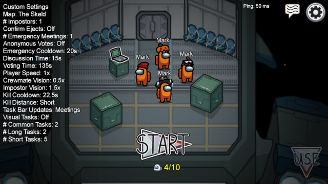

# Mark Mode for Among Us
A BepInEx mod for Among Us

The idea is basically: Everyone is Mark and everyone is orange. You can only refer to other players as Mark.
The name and color can be changed in the settings in BepInEx\config\local.marks-st.markmode.cfg though.  

This mod can be used on public servers, but every player needs the mod.

# Installation
Unzip all files into <Steam-Folder>\steamapps\common\Among Us and run the game.

# Development
Install Reactor Modding Framework according to the [Reactor Docs](https://docs.reactor.gg/docs/) and open the project in Visual Studio 
or a compatible IDE.
You will need to get some information and files (like a disassembled and disobfuscated Among Us) to work on this. A good place to start 
is the [Reactor Discord](https://discord.gg/Zcmsb9UGuq) and the [ExtraRolesAmongUs Mod](https://github.com/NotHunter101/ExtraRolesAmongUs).

# History
v0.3 - Fixed 2 bugs. Mod did assign hats even when deactivated. Path to Among Us was hard-coded instead of using the $(AmongUs) environment variable.  
v0.2 - Works on public servers. In-Game settings to enable/disable mod and use of pets and skins. Hats are now randomized on game start instead of player join.  
v0.1 - First release. Did not work on public servers.

# Resources
https://github.com/NuclearPowered/Reactor Modding Framework.  
https://github.com/BepInEx Patch Framework.  
https://github.com/DorCoMaNdO/Reactor-Essentials For in-game menu options.